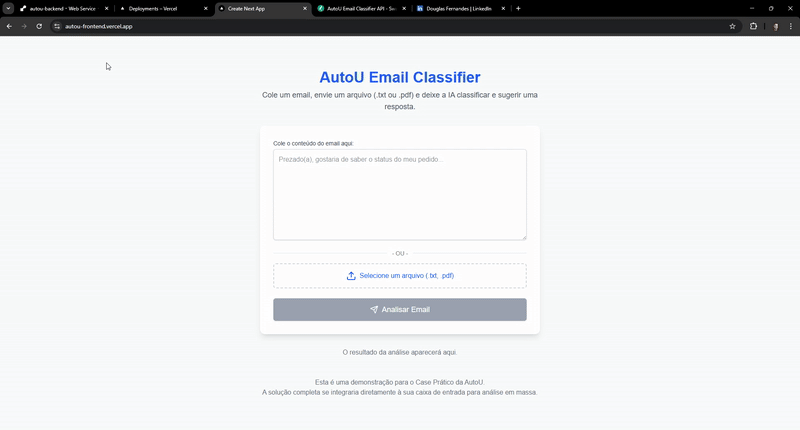

# AutoU - Case Prático: Classificador de Emails com IA 🚀

> **Aviso:** Esta é uma aplicação de demonstração que utiliza a API do Google Gemini. O uso é moderado para garantir que a aplicação permaneça funcional para o processo de avaliação. 😊

---

### 🎥 Demonstração Rápida



_Demonstração do fluxo de análise de um email, exibindo a classificação e a sugestão de resposta._

---

## ✅ Visão Geral e Funcionalidades

Este projeto é uma solução completa para o Case Prático de Desenvolvimento da AutoU. Trata-se de uma aplicação web full-stack que utiliza Inteligência Artificial para analisar, classificar e gerar respostas para emails, otimizando a produtividade de equipes.

- **Classificação Inteligente:** Identifica se um email requer uma ação (`Produtivo`) ou não (`Improdutivo`).
- **Respostas Automáticas:** Gera sugestões de respostas contextuais e com formatação profissional.
- **Múltiplos Formatos de Entrada:** Permite a análise de texto colado diretamente ou através do upload de arquivos `.txt` e `.pdf`.
- **Interface Reativa e Intuitiva:** Experiência de usuário fluida, com feedback visual claro (loading, sucesso, erro).
- **Funcionalidades de UX:** Inclui recursos pensados no usuário, como "Copiar Resposta" e "Ver Email Enviado".

---

## ⚙️ Tecnologias Utilizadas

- **Frontend:** React, Next.js, TypeScript, Tailwind CSS
- **Backend:** Python, FastAPI
- **IA & Cloud:** Google Gemini, Vercel (Frontend), Render (Backend)

---

## 🔧 Como Rodar o Projeto Localmente

### Pré-requisitos

- [Node.js](https://nodejs.org/en/) (v18+)
- [Python](https://www.python.org/downloads/) (v3.9+)
- Uma chave de API válida do [Google Gemini](https://aistudio.google.com/)

### Passos para a Instalação

1.  **Clone o repositório:**

    ```bash
    git clone https://github.com/DouglasFernan/autou-case-pratico.git
    cd autou-case-pratico
    ```

2.  **Configure o Backend:**

    ```bash
    cd backend
    python -m venv venv
    source venv/bin/activate  # No Windows: venv\Scripts\activate
    pip install -r requirements.txt

    # Crie o arquivo .env na pasta 'backend/' e adicione sua chave:
    # GOOGLE_API_KEY="SUA_CHAVE_SECRETA_DO_GEMINI_AQUI"
    ```

    > 💡 **Observação:** Em alguns ambientes locais, o carregamento do arquivo `.env` pode ser instável. Caso enfrente um erro de credenciais, uma alternativa para teste é inserir a chave de API diretamente no código (`gemini_service.py`), lembrando de **NÃO** enviar esta alteração para o GitHub. A versão em produção no Render utiliza as variáveis de ambiente de forma segura.

3.  **Configure o Frontend:**

    ```bash
    cd ../frontend
    npm install
    ```

4.  **Execute a Aplicação (2 terminais):**

        - Terminal 1 (na pasta `backend/`):
          ```bash
          uvicorn app.main:app --reload
          ```
        - Terminal 2 (na pasta `frontend/`):
          `bash

    npm run dev
    `      Acesse o frontend em`http://localhost:3000`.

---

## 📂 Dados de Exemplo

Para facilitar os testes, uma variedade de arquivos de exemplo (`.txt` e `.pdf`) com conteúdo produtivo e improdutivo pode ser encontrada na pasta [`assets/exemplos/`](./assets/exemplos/) deste repositório.

---

## 💡 Decisões Técnicas e Arquitetura

- **Uso de LLM vs. NLP Clássico:** Optei por utilizar um Large Language Model (Gemini) em vez de técnicas de NLP tradicionais. Esta foi uma escolha técnica deliberada, pois LLMs entendem o contexto completo do texto, e o pré-processamento manual prejudicaria a precisão da análise.

- **Engenharia de Prompt:** O "treinamento" e "ajuste" da IA foram realizados via engenharia de prompt, utilizando a técnica de "few-shot learning", fornecendo ao modelo exemplos claros para garantir alta precisão.

- **Arquitetura Desacoplada:** A escolha de separar Frontend (Next.js) e Backend (FastAPI) cria uma solução mais escalável e manutenível.

---

## 🗺️ Visão do Produto e Próximos Passos

Esta aplicação serve como uma robusta Prova de Conceito (PoC). Para evoluir para uma solução completa, os próximos passos seriam:

- **Integração Direta com Provedores de Email:** Conectar a aplicação via API (Google, Microsoft) para ingerir emails automaticamente.
- **Processamento Assíncrono:** Implementar uma fila de tarefas (com Celery e Redis) para analisar emails em segundo plano.
- **Dashboard de Triagem:** Transformar a interface em um dashboard completo com filtros e ações em massa.

---

## 👤 Autor

- **Nome:** Douglas Fernandes Soares Bessa
- **LinkedIn:** [https://www.linkedin.com/in/dougfernan/](https://www.linkedin.com/in/dougfernan/)
- **GitHub:** [https://github.com/DouglasFernan](https://github.com/DouglasFernan)
